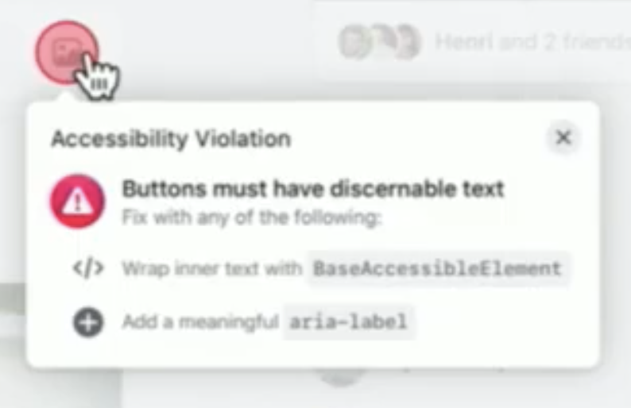
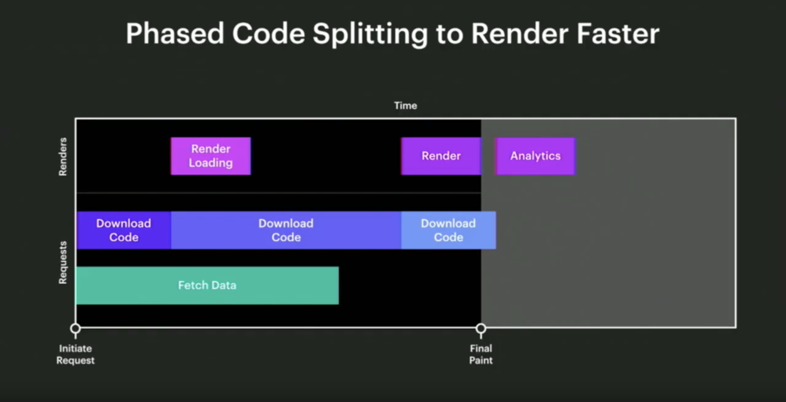
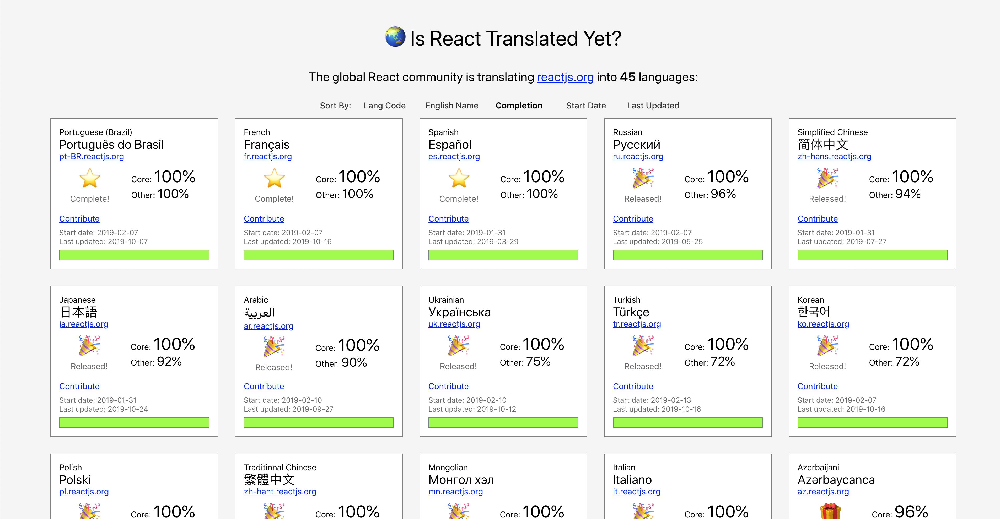
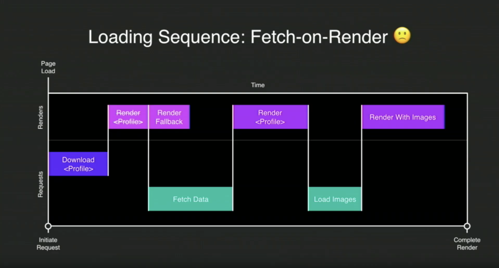
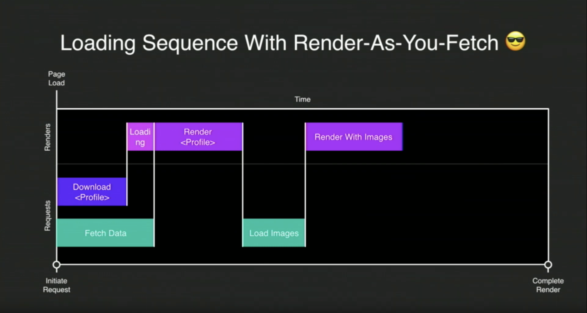

Well [React Conf](https://conf.reactjs.org) is officially over. There were a lot of great talks, human beings, activities, and of course food. I'm still digesting the whole event but, as far as conferences go, this has been the best one I've attended so far.

The developer community can often be intimidating. The volunteers and organizers did an incredible job making everyone at the conference feel welcome. I was impressed at the lengths they went to make us all feel like we belonged. There were even some _introvert activities_ on the second day. Have you ever painted a minifigure (think [Warhammer](https://www.games-workshop.com/en-CA/Warhammer)) at a conference? I have now! So for all those involved, thanks!

This post is going to be a reflection of _some_ of my favourite React Conf takeaways. Every single talk was worth watching, so I recommend you check out the recordings for [day one](https://www.youtube.com/watch?v=UxoX2faIgDQ) and [day two](https://www.youtube.com/watch?v=JDDxR1a15Yo). You might be surprised by some of the items on the list. I was too! Not everything is technical but there is a common thread weaving throughout.

_Since I think you should watch all the talks and the individual talks haven't been released I've left a list of links to the YouTube timestamps at the bottom!_

## Developer Experience In Service of User Exeperience

After [Tom Occhino](https://twitter.com/tomocchino) said it, I couldn't stop thinking about it. I couldn't stop seeing it in all the talks. I realized what I love so much about developer tools and the frontend.

React aims to create a developer experience that allows us to **easily** learn to do powerful things, to launch and iterate by being **productive**, and to **scale** the software we make. These things alone make me like React. I feel like Facebook is doing a pretty good job on delivering.

What is the point of all this though? Well, that's simple. It's to serve the user experience. We do what we do so that we can make our _users productive_. We should aim to help them get what they want done in elegant ways. Although what we help them achieve may not always be simple behind closed doors, it should always _feel that way_ to them.

Because React is a _gateway techhnology with 63% of JavaScript developers_ using it, the team are taking things like community very seriously. They have adopted the [Contributor Covenant](https://www.contributor-covenant.org/) and are welcoming criticism. As a community we should be able to accept criticism without having to defend ourselves. Elbert Hubbard said **"To avoid criticism say nothing, do nothing, be nothing."** What React is doing, and why, is important. This will naturally draw in criticism and allow the technology to grow. It will allow us as a community to _be better_.

## Accessiblity and Performance and Concurrent Mode, Oh My!

Have you ever had issues with focus while using React? I have. [Focus is really important](https://hacks.mozilla.org/2019/06/indicating-focus-to-improve-accessibility/) for many reasons. It helps people navigate their way through a page. This is extremely important for people who don't use a mouse. This topic will come up again later, but it was nice to see the React team wanting to make accessibility baked in.

One of the things that got me thinking the most during the conference was performnce. Facebook has to deal with performance issues that most of us never will, but the lessons they have learned can still be used to _make the user experience better_. It doesn't matter how fast a page loads if the perceived performance is slow.

An example of this is [selective hydration](https://youtu.be/UxoX2faIgDQ?t=3535) which [Yuzhi Zheng](https://twitter.com/yuzhiz) explained during her talk. You may have heard of [Suspense](https://reactjs.org/docs/concurrent-mode-suspense.html#what-is-suspense-exactly) as well, which will improve user experiences all over the web.

### Concurrent Mode

Imagine making a filterable list tied to a user input. With React, you'd probably have to debounce or throttle your updates to the list unless you're okay with jank.

[Concurrent Mode](https://reactjs.org/docs/concurrent-mode-intro.html#what-is-concurrent-mode) will enable React apps to be more responsive by giving React the abiility to interupt blocks of lower priority work. This allows things like user input to get more priority over things like re-rendering a list. React will be able to work on several state updates _concurrently_. This will help us remove jarring and too frequent DOM updates. It will also allows us to give priority to interactions like hover and text input. We know that users expect these to be handled quickly or else they will feel laggy.

The React team have [shared many examples of concurrent mode patterns](https://reactjs.org/docs/concurrent-mode-patterns.html) that I recommend you check out.

## CSS-in-JS-at-FB

I was interested to hear [Frank Yan](https://twitter.com/frankyan) announce that Facebook is building their own CSS-in-JS library. At first I thought, don't we have enough of them? This gave us an opportunity to learn more about some of the problems Facebook faces at scale and the creative ways they are solving them.

Maintaining CSS can quickly get out of hand. Let's look at the following example:

```css
.blue { color: blue; }

.red { color: red; }
```

```html
<span class="red blue">
  Which color will I be?
</span>
```

In this example, it would be nice if the text would be _blue_. That class comes second in the class declaration so we _should_ be able to expect it to take precedence. But it doesn't. The `.red` class comes second in the _cascading_ style sheet so that's what we end up with. If these classes were in diffrent style sheets, the order in which they are loaded in the page would matter.

This problem might seem simple with such a naïve example but it can get out of hand quickly. Facebook has aimed to resolve things such as specificity wars, themeability, and accessibility with their new library.

A couple of interesting specifics from the talk:
- Developers can code in pixels but have their work compiled in REMs
- They have created safety by implementing type checks (catch and fix typos, detect and remove unused styles, avoid cross-browser pitfalls)
- Display accessibility errors to developers

<div className="Image__Small">
  
</div>

- Components can have default styles that can be overidden (including type safety!)
- Rules are deduplicated which allows smaller CSS files (Facebook went from `413kb` to `74kb` in their recent frontend rewrite)

### Atomic CSS

Each class creates a unique property value pair. This is used to [optimize the components](https://youtu.be/UxoX2faIgDQ?t=4939)

```css
.c0 { color: blue; }
.c1 { color: red; }
.c2 { font-size: 16px; }
```

```jsx
// Generated Component (Pre-Optimized)
const styles = {
  blue: {color: 'c0'},
  default: {color: 'c1', fontSize: 'c2'},
};

function MyComponent(props) {
  return (
    <span className={styles(
      'default',
      props.isBlue && 'blue',
    )}>
      Hello World!
    </span>
  );
}
```

This example shows how the CSS is atomic. It also shows how the color of a span could be set with props. However, this code gets optimized further.

```jsx
// The styles block is no longer needed
function MyComponent(props) {
  return (
    <span className={styles(
      (props.isBlue ? 'c0 ' : 'c1 ') + 'c2 '
    )}>
      Hello World!
    </span>
  );
}
```

At of these things are extremely interesting and I look forward to them releasing their library in the future.

## Data-Driven JavaScript

Have you ever wondered how to make your pages feel faster? Become interactive sooner? Of course you have! [Ashley Watkins](https://twitter.com/catchingash) has too. She really got me thinking how I could use adjust my data-fetching approach to make a better user experience. I had already started to get excited about Relay but she added fuel to the fire.

### Phased Code Splitting

You can bet the folks at Facebook have been working hard to ensure their FMP is as fast as possible. One of the ways they are doing this is "Phased Code Splitting".

With this approach, you can take a single blocking download and deliver it in phases. For example, if you consider the Facebook post, you could break it into 3 phases.

1. Loading
2. Display
3. Analytics

Each of these phases can have their own code fetch and render. All the data required for the FMP can be fetched at the same time the loading phase fetches its code.

<div className="Image__Small">
  
</div>

### Time to First Meaningful painted

To make your user experience as good as it can be, you should be thinking about [first meaningful paint](https://developers.google.com/web/tools/lighthouse/audits/first-meaningful-paint). This is basically how long it takes for the primaary content to appear on the page. There are many metrics you can look at and measure to improve your load times, but FMP sticks out.

Relay allows you to make _streamed queries_ with GraphQL. This will allow you to mark certain data as critical and other data as less critical. You can then get the most important stuff from the server first and show that while fetching the rest of your data. With this approach, you can render content as it arrives!

### Data-Driven Code Splitting

This one blew my mind a bit. Relay is powerful, no question there. Relay has a new feature that lets you expand your queries to express which component code you need to render specific data types. 🤯 You can think of your code _as data_. As the server is resolving your GraphQL query, it can let the client know what component code it is going to need to download so it can get it faster!

Ashley's talk was pretty incredible and she promised that these things are just the beginning. I haven't used Relay yet but I'm excited to get started and I bet you will be too (especially when you hear more about what it can do).

## Solving World Hunger

Day one started of with a great group of talks from people that work at Facebook. They were exciting from the technical perspective. We got to see a lot of upcoming features in the ecosystem to help us improve the user experience.

[Tania Papazafeiropoulou](https://twitter.com/_Tany_) switched gears a little bit to educate the attendees about world hunger and a cool product she's working on called [OLIO](https://olioex.com). It helps people share food instead of wasting it and its powered by, you guessed it, React.

It was upsetting to find out that **1/3 of all food produced is wasted**. On top of that, we could solve world hunder with just **25%** of food waste from the US, UK, and Europe. These sobering statistics make solving world hunger possible and it was awesome to hear about a team working to do that.

This talk didn't get me hyped about new React features but it reinforced what makes React great. React (and React Native) enabled Tania's team to build out their product quickly and start making a positive impact.

## Making REST Feel Better (and Safe)

[RESTful APIs](https://en.wikipedia.org/wiki/Representational_state_transfer) aren't a new hot 🔥 concept. They were formally defined in 2000 and have been used with success since then. That being said, REST does have some things that make it challenging.

Facebook answered these challenges with GraphQL. GraphQL gives us an understandable definition of our data. It gives the client the power to get only what it needs. This is a pretty great way to get faster render times as you don't have to download as much data!

[Tejas Kumar](https://twitter.com/tejaskumar_) summed up the differences quite nicely (see [his talk](https://youtu.be/UxoX2faIgDQ?t=9586) for more depth):

#### REST

- ❌ No formal spec
- ❌ Guessing games (will an unallowed request respond with `400`, `401`, or `404`?)
- ❌ Meaningless conversations
- ❌ No contractual agreements


#### GRAPHQL

- ✅ Formal spec
- ✅ No guessing games
- ✅ Meaningful discussions (things that impact users)
- ✅ Strong contractual agreements

Many of us love GraphQL but sometimes it isn't an option for our APIs. Tejas and his team have [developed a tool to take some of the pitfalls away from REST](https://github.com/contiamo/restful-react). It includes code-generation from Swagger and OpenAPI specs.

I don't believe I do Tejas justice but his talk left a lasting impression on me. Seriously, [go watch his talk](https://youtu.be/UxoX2faIgDQ?t=9586)!

## Under React's Hood (Building a Custom Renderer)

If you've ever given a demo of something you coded before, you know it often goes wrong. [Sophie Alpert](https://twitter.com/sophiebits) took the risk and educated us on what it takes to build a React renderer.

I don't consider myself a React expert (_yet_ 😅). I have never looked at the React codebase. I always assumed it would be beyond me. As I continue to learn and master React, I will continue digging deeper and will eventually get to the codebase itself. Sophie made it seem a lot less intimidating as she built her own custom render _in real time_ on the React Conf stage.

Other than learning how awesome Sophie is, I feel like I came away with a small understanding of how React renderers work. She didn't leave me scratching my head. Everything was explains simply but also demonstrated clearly. What more can you ask for from a live coding demo?

May the Demo Gods forever be in your favour Sophie!

## Localization (It's Important!)

As a native English speaker, I have to admit that localization isn't the first thing that comes to my mind when developing a product. Thankfully I am aware of this and am going to take it more seriously in the future.

I think localization often gets missed gets missed because we focus on users who are just like us. There is no reality where your users will be exactly like you! That is why we need to do user testing, get user feedback, and be more inclusive to all types of humans.

Last year, [Nat Alison](https://twitter.com/tesseralis) asked the question "is React translated yet?" When she originally posed the question, the answer was no.

Why does this matter? Well, Nat put it pretty nicely. If React is only accessible to English speaking people, how many people aren't able to use the tools to build amazing products? How much are we losing out on by only having English speakers shape our digitl world? Only **20% of the world's population speaks English**. If we don't help others use React, we all suffer!

<div className="Image__Small">
  
</div>

It is incredible what Nat and thousands of people have accomplished in the last year. There is still more work todo and [you can help if you are bilingual](https://isreacttranslatedyet.com/)!

## The Accessiblity Marathon

Just like localization, accessibility can be difficult. You have to think differently when you are developing for accessibility. You have to think about a broader audience, about people who might be _different_ than you. Sometimes that is difficult but we can all do it.

Running a marathon is another example of something that can be difficult. According to RunRepeat, [1,298,725](https://runrepeat.com/research-marathon-performance-across-nations) people finished a marathon in 2018. They didn't wake up with the ability to do that. They started small and worked their way up to it.

That's how we can approach accessibility. Taking an approach like this will remove some of the feeling of overwhelm if you are starting from square one. One of my favourite things about React Conf was learning about software development, and the world, from new viewpoints. [Brittany Feenstra](https://twitter.com/BrittanyIRL) was one of the people who helped me expand my perspective and I want to think more about accessibility going forward.

I'm not going to complete the accessibility marathon over night but I can do a little more each day going forward. Thankfully, there are a lot of [good](https://chrome.google.com/webstore/detail/axe-web-accessibility-tes/lhdoppojpmngadmnindnejefpokejbdd) [tools](https://chrome.google.com/webstore/detail/axe-web-accessibility-tes/lhdoppojpmngadmnindnejefpokejbdd) to [help](https://github.com/FormidableLabs/eslint-plugin-react-native-a11y) me along the way.

## You Don't Need Redux (Right?)

In 2019 there are [many](https://reactjs.org/docs/react-component.html#setstate) [different](https://reactjs.org/docs/context.html) [ways](https://reactjs.org/docs/hooks-intro.html) [to](https://github.com/reduxjs/redux) [manage](https://github.com/jamiebuilds/unstated) [React](https://github.com/mobxjs/mobx) [state](https://www.apollographql.com/docs/react/data/local-state/) (even [vegetarian friendly options](https://easy-peasy-v3.now.sh/)).

With so many options out there it can be hard to know what is the right choice. Unfortunately the _right_ choice will depend on you. Just remember, _developer experience is in service of user experience_. Knowing that, I liked to approach my state management by going as simple as possible and changing as I outgrew my original decision.

I am very happy that React has so many options built within it now. With Context and Hooks, you can do quite a lot without ever needing to pull in another dependancy.

In order to move fast and break things, you have to be willing to throw out work you've done before. You need to fall in love with the refactor and move past decisions that worked for you when your product was different. I think the many options for React state reflect this. Some of the options require a lot of boiler plate, some don't. Some are baked in, some aren't. Pick what feels right for you now and adapt later if you need to.

## Time Travel To 1999

[The last talk of the day](https://youtu.be/UxoX2faIgDQ?t=30919) had me interested from the title alone. What was it like to program in 1999? I was only nine years old then. Some people were coding by nine. I was not one of them. 😢

This talk was another one that really needs to be watched. [Lee Byron](https://twitter.com/leeb) delivered a well-polished gem. He walked us through a time when PHP and the LAMP stack were the go to tools for web development. For those that weren't coding in 1999, he explained the evolution that lead Facebook to develop tools like React, GraphQL, and Relay. For those who were coding then, nostalgia.

I have always respected the engineering work done at Facebook but this talk put everything in perspective. Working with React has felt like a privilage and now I know where that privilage came from. I'm inspired by the work people like Lee have and continue to do for the community.

## Even Dev Tools Are About UX

The theme of the conference continued to be elaborated on as [Brian Vaughn](https://twitter.com/brian_d_vaughn) kicked off day two. If you build things with React, you've likely used the React Dev Tools. They have definitely helped me dig myself out of messes I've created.

The React Dev Tools got a full rewrite that gives us:

- Better performance
- New API support
- New UX features

_See, even the dev tools focus on great UX!_

I was impressed by the changes the team made to help navigate unfamiliar projects. Although you may thing of code you never touched as unfamiliar, we all know that even our own code can seem foreign with time. We can now see how prop flow through components, filter our component trees, deeply inspect components, and use hooks with the dev tools. One of the other things I loved seeing was the suspense toggle. That's a feature that seems extremely simple but will quickly become invaluable.

Along with shared profiling, the new dev tools make it easier to find why things rendered. There [are similar tools out there](https://github.com/welldone-software/why-did-you-render) but now we can get insight on your renders directly in the dev tools.

There are a ton of other great additions and I recommend you [go explore them for yourself](https://react-devtools-tutorial.now.sh/).

## Suspenseful Data (Relay is Awesome)

I think I'm probably late to the Relay party. In fact, I'm late to the GraphQL party. In my [side project](https://writewithwrabit.com) I have been using GraphQL and I really enjoy it. After this conference I'm looking to explore Relay and take advantage of the power the combo provides.

[React Suspense](https://reactjs.org/docs/concurrent-mode-suspense.html#what-is-suspense-exactly) wants to enable us to show _some_ of a UI without waiting for _all_ of it to become ready.

Let's take a look at a basic example of a component that shows a loading state (using Suspense) when it is fetching data:

```jsx
const Composer = (props) => {
  const data = useQuery(graphql`
    query ComposerQuery {
      me {
        photo {
          uri
        }
      }
    }
  `, variables);

  return (
    <div>
      
    </div>
  );
}

const Home = (props) => (
  <Suspense fallback={<Placeholder />}>
    <Composer />
  </Suspense>
);
```

In this example we have a `Composer` component that fetches a URI to my profile picture and then displays it. You can see in the `Home` componenet that we have wrapped `Composer` within a `Suspense` block. Then, while the data is loading, `Placeholder` will be rendered. This pattern can be thought of as _Fetch On Render_.

Using this pattern, the loading sequence will be as follows:

<div className="Image__Small">
  
</div>

As you can see, this allows us to easily handle data loading. We can provide a better user experience by falling back to a loading component, like a placeholder or spinner.

The pattern above already provides a lot of benefits and flexibility to do cool tihngs. However, the Facebook team didn't like that you had to _render_ to figure out what _data the component needs_. In order to get over this, they have started to use a pattern they call _Render As You Fetch_.

Essentially, to enable Render As You Fetch, the Facebook team has decomposed `useQuery` into two pieces. It is separated into `preloadQuery` and `usePreloadedQuery`. What exactly does that mean?

### `preloadQuery`

This API will fetch data and give a reference to the results. It doesn't give you the actual data.

You would call this API in the same event handler that would display new UI. For example, if a user clicks on a link that will trigger navigation to a new page, the event handler where we handle the click will use `preloadQuery`. Hovering over something to open a tooltip would be another example of where you'd call this API. The `onHover` event handler would call `preloadQuery`.

### `usePreloadedQuery`

This API takes the results of the `preloadQuery` call. It doesn't actually do any data fetching itself. It looks at the current state of the `preloadQuery`. If it is ready, it displays the results. If it is _not_ ready, it suspends. If the query has failed, then we can throw an error.

No matter what happens, `usePreloadedQuery` will never trigger a new fetch. This makes it efficient and predictable.

Using these two APIs instead of `useQuery` will provide a loading sequence that looks like the following:

<div className="Image__Small">
  
</div>

I definitely recommend you listen to [Joe Savona](https://twitter.com/en_JS) explain the concepts I've summarized above. He does a better job and gets more in-depth. This was one of my favourite talks because I'm excited by the possibilities this pattern enables and can't wait to try it myself.

## React is Fiction

[Jenn Creighton](https://twitter.com/gurlcode) gave my favourite philosophical talk of the conference. She background in creative writing. Creative writing has always been something I loved. Like Jenn, I once fantasized about becoming an author. There was a concept she explained during her talk that translates to coding in an interesting (and unexpected) way.

> Show, don't tell

Let's look at two ways to convey the same meaning (courtesy of Jenn).

She is tired.

Her footsteps are heavier than before, the weight increasing as she trudges towards the bed, collapsing face-first onto the mattress.

Same idea, right? She is dead tired. Which one is more powerful? Well that's obvious. As software engineers we often fall into the pit of telling. We abstract, abstract, abstract away until we are [DRY](https://en.wikipedia.org/wiki/Don%27t_repeat_yourself) as can be.

Most of the time, I do try to avoid repetition in my code. The principle makes sense but, like the rules of writing, sometimes we need to break the rules of software development. Let's compare two different pieces of code achieving the same result.

```jsx
const Nav = ({ links }) => (
  <nav>
    {
      links.map(link => (
        <Link to={link.to}>{link.name}</Link>
      ))
    }
  </nav>
);

const Header = () => {
  const links = [
    { name: 'Home', to: '/home' },
    { name: 'Settings', to: '/settings' },
  ];

  return (
    <>
      <Nav links={links} />
    </>
  );
}
```

This seems like it will work great, but what if we want to add a nav item that is an action? For example a login button.

```javascript
  const links = [
    { name: 'Home', to: '/home' },
    { name: 'Settings', to: '/settings' },
    { name: 'Login', to: '??' },
  ];
```

Our `Nav` component doesn't handle this edge case. We _could_ easily implement a method for it to handle it but this could easily get out of hand. We could refactor the `Nav` componnt to look something like this:

```jsx
const Nav = ({ links }) => (
  <nav>
    {
      links.map(link => {
        return link.to
          ? <Link to={link.to}>{link.name}</Link>
          : <a onClck={link.onClick}>{link.name}</Link>
      })
    }
  </nav>
);
```

This _would_ work but how many edge cases will we cover before it becomes harder to reason about our `Nav` component? We could rewrite the `Header` component another way.

```jsx
const Header = () => {
  const links = [
    { name: 'Home', to: '/home' },
    { name: 'Settings', to: '/settings' },
    { name: 'Login', to: '??' },
  ];

  return (
    <nav>
      <Link to="/home">Home</link>
      <Link to="/settings">Settings</link>
      <a onClick={onSelectLogin}>Login</a>
    <nav/>
  );
}
```

I've simplified the example that Jenn delivered in her talk but I think it gets the point across. The second `Header` component is much easier to reason about. The abstraction didn't provide much benefit even though we mighth be repeating ourselves now. If we wanted to add an `Icon` component into _one_ of the links, we don't have to handle all the edge cases in a `Nav` component anymore, we can just add it where we want it.

Jenn also quoted a great Neil Gaiman quote that I can't resist sharing.

> Remember that, sooner or later, before it reaches perfection, you will have to let it go and move on and start to write the next thing.

I've been practicing getting to _good enough_ while I've been working on [Wrabit](https://writewithwrabit.com). Sometimes it makes me feel like less of a developer. Sometimes it makes me feel lazy. In the end, I'm going with what I can easly understand, what I can ship, and what I can always refactor later.

As Jenn said, refactoring is not failure. Her talk weaved creative writing with programming so elegantly, I'll definitely be watcing it again.s


## UX-Driven Fluid Animations

I haven't gotten around to making too many animations. I envision a future where I take awesome UI designs from Dribbble (animations and all) and build them out for practice. Animations are definitely delightful bits of design porn, but we need to keep the user experience in mind even with these.

Like most of the talks, [Alex Holachek](https://twitter.com/alex_holachek) got me thinking in a new way. I love UI interactions. They make me feel warm and fuzzy inside. When looking at them, I'm guilty of not considering all of the users.

How to the fancy animatons work for someone using a [Nokia 6](https://www.nokia.com/phones/en_int/nokia-6)? At $283.97 CAD from Amazon, I could afford that many times over before the new iPhone. I'm guessing a lot of other people are in the same camp.

Alex helped me remember to think more about the average. Average phones, average data speeds. Build for average and high end will always be fine.

Also, `event.preventDefault()` will do bad things to your scrolling.

## Iterating on Real Experiences

If you couldn't tell, there was tons of variety in the talks this year. [Luca Demasco](https://twitter.com/Lucapodular) kept things fresh by showing us the process of iteration as he devloped the [Wick Editor](https://www.wickeditor.com) with [Zach Rispoli](https://twitter.com/zrispo).

The Wick Editor is a free and open-source tool for creating games, animations, and anything else your mind can come up with. When Luca showed off the current version, I was really impressed with the UI. It seemed intuitive and had plenty of functionality. That wasn't always the case.

Luca and friends got to where they are today by constantly iterating. They didn't just iterate for the sake of iteration either. They to Wick into many different environments (schools, libraries, etc.) and brought the interface in front of many different users (begineer, intermeidate, young, old). They took a laser focused approach and gathered feedback that helped make Wick what it is today.

The honesty in the process inspired me as I think about how to iterate on my own product. How can I launch somethhing quickly and iterate with intention? I don't have that experience so sometimes the confidence escapes me but its a process I'm excited to take. Seeing people like Luca share his experience encourages me and I'm grateful for the honesty that was shared by everyone during the conference.

## The Complexity of Simple Things

Do you use [react-select](https://react-select.com)? No? You probably do but you just don't know it.

The component has over [18k](https://github.com/JedWatson/react-select) stars on GitHub. It has 1.5 _million_ downloads per week. That's a lot.

You might not think that one simple React component could be all that complex. You would, of course, be wrong. [Jed Watson](https://twitter.com/JedWatson) has developed a React component that is beautiful and serves its purpose well. It has plenty of functionality and works great out of the box.

Jed travelled a long (and sometimes arduous) road to get [react-select](https://react-select.com) to where it is today. He shared great insights on what its like to develop a massively popular open-source project. He also showed how simple things can often be quite complex.

I was inspired by Jed when he showed off the evolution of [react-select](https://react-select.com) to v2.0. He reiteratd the importance of refactoring and the wonderful things you can accomplish if you stop chasing perfection.

## Beautiful Transparency

Government spending is an important topic. We deserve to see where our tax money is going so that we can keep the government accountable.

[Lizzie Salita](https://twitter.com/ebsalita) demonstrated that government websites can be performant, easy to use, and beautiful. I was actually quite surprised when she demoed the [USAspending.gov](https://www.usaspending.gov/#/explorer) spending explorer. Compare that to the [Canadian version](https://www.canada.ca/en/treasury-board-secretariat/topics/reporting-government-spending.html) and you'll get an example of how much React can shape the user experince.

I'm slowly starting to get my feet wet with regards to politics. While I have always tried to stay informed enough to vote, there is so much more I can do. Having tools like [USAspending.gov](https://www.usaspending.gov) in your hands makes it easier and more interesting. I think we should continue to develop tooling like this to enable everyone to stay informed so that we can all be involved in shaping our future.

## Wonder-Driven Development

The last talk of the conference really blew my mind. Like [Alex Anderson](https://twitter.com/ralex1993), I am a big fan of space 🚀. Alex has built an insanely complex starship simulator called [Thorium](https://thoriumsim.com/).

The Thorium simulator empowers many organizations like the [Lion's Gate Space Center](https://www.thelionsgatecenter.com/about) to provide STEM-related activities for all kinds of people. These space centers allow students to grow through group activities that are highly interactive and educational.

There have been more than a few presentations and people at React Conf doing highly inspirational things for good causes. Alex's work sticks out because his passion leaks out of every word he says. He loves what he is doing and is an extremely talented engineer. He's using the technology available to him to build great experiences for kids and adults alike.

My favourite take away from Alex's talk (it's going to take me a while to fully digest it) is the concept of _wonder-driven development_. Have you ever wondered about the possibilities of technology? What about what _you_ are capable of?

These types of questions drive us to build fun, enjoyable, and truly beautiful experiences. These types of questions allow engineers at Facebook and companies all around the world to shape our world with technology.

I've learned so much from everyone I came across at React Conf this year. I'm grateful that I was able to attend and am feeling full of wonder and excitement.

I can't wait to see what that wonder drives me to develop!

---

As I mentioned before, these are just a _few of my takeaways_. There were many libraries, techniques, and philosophical ideas shared throughout the two day conference. I wish I could have captured them all! If you go next year you'll know what I mean.

If you'd like me to expand on any of these ideas I'd be more than willing to. Reach out and let me know!

Finally, it would be a crime not to mention [Devon Lindsey](https://twitter.com/devonbl). She gave us laughter, candy, and introvert activities. The conference wouldn't have been the same without her.

### Le Talks (With Timestamps)
️
#### Day One

- [Keynote @ 00:33:07](https://youtu.be/UxoX2faIgDQ?t=1987): [Tom Occhino](https://twitter.com/tomocchino) & [Yuzhi Zheng](https://twitter.com/yuzhiz)
- [Building The New Facebook With React and Relay @ 01:09:45](https://youtu.be/UxoX2faIgDQ?t=4185): [Ashley Watkins](https://twitter.com/catchingash) & [Frank Yan](https://twitter.com/frankyan)
- [How Our Team Is Using React Native to Save The World @ 01:43:46](https://youtu.be/UxoX2faIgDQ?t=6226): [Tania Papazafeiropoulou](https://twitter.com/_Tany_)
- [Using hooks and codegen to bring the benefits of GraphQL to REST APIs @ 02:39:03](https://youtu.be/UxoX2faIgDQ?t=9543): [Tejas Kumar](https://twitter.com/tejaskumar_)
- [Building a Custom React Renderer @ 03:11:21](https://youtu.be/UxoX2faIgDQ?t=11481): [Sophie Alpert](https://twitter.com/sophiebits)
- [⚡️Codemod-ing Away 4MB of JavaScript @ 05:02:33](https://youtu.be/UxoX2faIgDQ?t=18153): [Spencer Miskoviak](https://twitter.com/spencerskovy)
- [️⚡️️️️️git is hard but time travel in git is easy @ 05:09:20](https://youtu.be/UxoX2faIgDQ?t=18560): [Monica Powell](https://twitter.com/waterproofheart)
- [️⚡️️️️️Typescript, GraphQL, and Code Generation @ 05:16:25](https://youtu.be/UxoX2faIgDQ?t=18985): [Salvatore Aiello](https://twitter.com/dested)
- [️⚡️️️️️Why React is Eating the World @ 05:22:55](https://youtu.be/UxoX2faIgDQ?t=19375): [Adam Wolff](https://twitter.com/dmwlff)
- [Is React Translated Yet? @ 05:32:58](https://youtu.be/UxoX2faIgDQ?t=19978): [Nat Alison](https://twitter.com/tesseralis)
- [Building (And Re-Building) the Airbnb Design System @ 06:07:13](https://youtu.be/UxoX2faIgDQ?t=22033): [Maja Wichrowska](https://twitter.com/majapw) & [Maja Wichrowska](https://twitter.com/taekimjr)
- [Accessibility Is A Marathon, Not A Sprint @ 07:33:32](https://youtu.be/UxoX2faIgDQ?t=27212): [Brittany Feenstra](https://twitter.com/brittanyIRL)
- [The State of React State in 2019 @ 08:05:17](https://youtu.be/UxoX2faIgDQ?t=29117): [Becca Bailey](https://twitter.com/beccaliz)
- [Let's Program Like It's 1999 @ 08:35:14](https://youtu.be/UxoX2faIgDQ?t=30914): [Lee Byron](https://twitter.com/leeb)

#### Day Two

- [React Developer Tooling @ 00:32:00](https://youtu.be/JDDxR1a15Yo?t=1920): [Brian Vaughn](https://twitter.com/brian_d_vaughn)
- [Data Fetching With Suspense In Relay @ 01:00:31](https://youtu.be/JDDxR1a15Yo?t=3631): [Joe Savona](https://twitter.com/en_JS)
- [Automatic Visualizations of the Frontend @ 01:32:17](https://youtu.be/JDDxR1a15Yo?t=5537): [Cameron Yick](https://twitter.com/hydrosquall)
- [React Is Fiction @ 02:32:13](https://youtu.be/JDDxR1a15Yo?t=9133): [Jenn Creighton](https://twitter.com/gurlcode)
- [Progressive Web Animations @ 02:57:48](https://youtu.be/JDDxR1a15Yo?t=10668): [Alexandra Holachek](https://twitter.com/alex_holachek)
- [️⚡️️️️️Programming = Hit Records @ 05:03:06](https://youtu.be/JDDxR1a15Yo?t=18186): [Jay Johnson](https://twitter.com/therealjdash)
- [️⚡️️️️️Comonads On Your Everyday UI Tools @ 05:10:50](https://youtu.be/JDDxR1a15Yo?t=18650): [Juan Paucar](https://twitter.com/juxncxrlosp)
- [Creating Games, Animations and Interactions with the Wick Editor: A UX Talk @ 05:27:53](https://youtu.be/JDDxR1a15Yo?t=19673): [Luca Damasco](https://twitter.com/Lucapodular)
- [Building React-Select @ 06:01:52](https://youtu.be/JDDxR1a15Yo?t=21712): [Jed Watson](https://twitter.com/JedWatson)
- [Promoting Transparency in Government Spending with React @ 07:32:39](https://youtu.be/JDDxR1a15Yo?t=27159): [Lizzie Salita](https://twitter.com/ebsalita)
- [Wonder-driven Development: Using React to make a Spaceship @ 07:57:17s](https://youtu.be/JDDxR1a15Yo?t=28637): [Alex Anderson](https://twitter.com/ralex1993)
