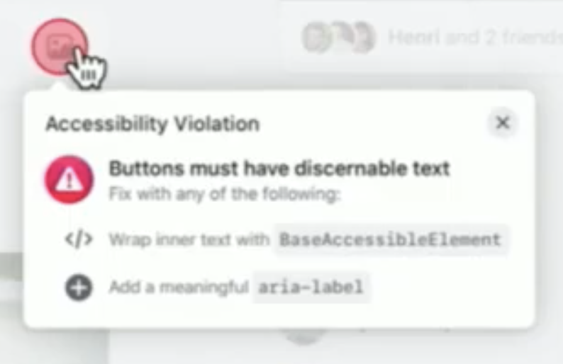
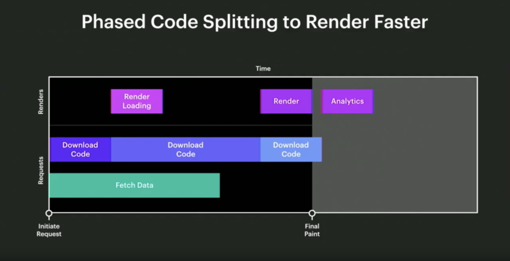
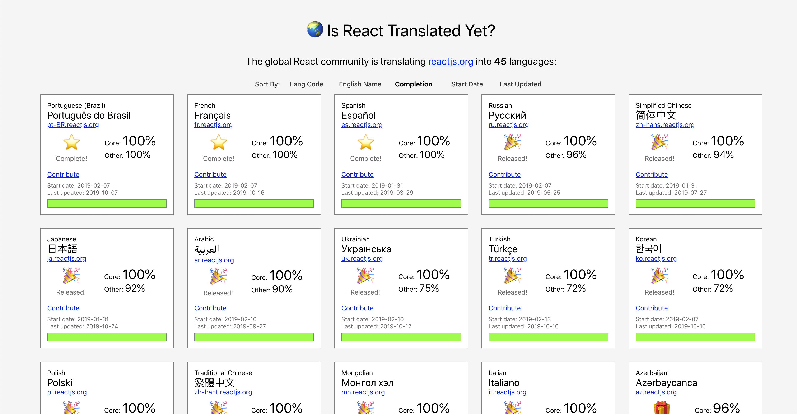

Well [React Conf](https://conf.reactjs.org) is officially over. There were a lot of great talks, human beings, activities, and of course food. I'm still digesting the whole event but, as far as conferences go, this has been the best one I've attended so far.

The developer community can often be intimidating. The volunteers and organizers did an incredible job making everyone at the conference feel welcome. I was impressed at the lengths they went to make us all feel like we belonged. There were even some _introvert activities_ on the second day. Have you ever painted a minifigure (think [Warhammer](https://www.games-workshop.com/en-CA/Warhammer)) at a conference? I have now! So for all those involved, thanks!

This post is going to be a reflection of _some_ of my favourite React Conf takeaways. Every single talk was worth watching, so I recommend you check out the recordings for [day one](https://www.youtube.com/watch?v=UxoX2faIgDQ) and [day two](https://www.youtube.com/watch?v=JDDxR1a15Yo). You might be surprised by some of the items on the list. I was too! Not everything is technical but there is a common thread weaving throughout.

## Developer Experience In Service of User Exeperience

After [Tom Occhino](https://twitter.com/tomocchino) said it, I couldn't stop thinking about it. I couldn't stop seeing it in all the talks. I realized what I love so much about developer tools and the frontend.

React aims to create a developer experience that allows us to **easily** learn to do powerful things, to launch and iterate by being **productive**, and to **scale** the software we make. These things alone make me like React. I feel like Facebook is doing a pretty good job on delivering.

What is the point of all this though? Well, that's simple. It's to serve the user experience. We do what we do so that we can make our _users productive_. We should aim to help them get what they want done in elegant ways. Although what we help them achieve may not always be simple behind closed doors, it should always _feel that way_ to them.

Because React is a _gateway techhnology with 63% of JavaScript developers_ using it, the team are taking things like community very seriously. They have adopted the [Contributor Covenant](https://www.contributor-covenant.org/) and are welcoming criticism. As a community we should be able to accept criticism without having to defend ourselves. Elbert Hubbard said **"To avoid criticism say nothing, do nothing, be nothing."** What React is doing, and why, is important. This will naturally draw in criticism and allow the technology to grow. It will allow us as a community to _be better_.

## Accessiblity and Performance and Concurrent Mode, Oh My!

Have you ever had issues with focus while using React? I have. [Focus is really important](https://hacks.mozilla.org/2019/06/indicating-focus-to-improve-accessibility/) for many reasons. It helps people navigate their way through a page. This is extremely important for people who don't use a mouse. This topic will come up again later, but it was nice to see the React team wanting to make accessibility baked in.

One of the things that got me thinking the most during the conference was performnce. Facebook has to deal with performance issues that most of us never will, but the lessons they have learned can still be used to _make the user experience better_. It doesn't matter how fast a page loads if the perceived performance is slow.

An example of this is [selective hydration](https://youtu.be/UxoX2faIgDQ?t=3535) which [Yuzhi Zheng](https://twitter.com/yuzhiz) explained during her talk. You may have heard of [Suspense](https://reactjs.org/docs/concurrent-mode-suspense.html#what-is-suspense-exactly) as well, which will improve user experiences all over the web.

### Concurrent Mode

Imagine making a filterable list tied to a user input. With React, you'd probably have to debounce or throttle your updates to the list unless you're okay with jank.

[Concurrent Mode](https://reactjs.org/docs/concurrent-mode-intro.html#what-is-concurrent-mode) will enable React apps to be more responsive by giving React the abiility to interupt blocks of lower priority work. This allows things like user input to get more priority over things like re-rendering a list. React will be able to work on several state updates _concurrently_. This will help us remove jarring and too frequent DOM updates. It will also allows us to give priority to interactions like hover and text input. We know that users expect these to be handled quickly or else they will feel laggy.

The React team have [shared many examples of concurrent mode patterns](https://reactjs.org/docs/concurrent-mode-patterns.html) that I recommend you check out.

## CSS-in-JS-at-FB

I was interested to hear [Frank Yan](https://twitter.com/frankyan) announce that Facebook is building their own CSS-in-JS library. At first I thought, don't we have enough of them? This gave us an opportunity to learn more about some of the problems Facebook faces at scale and the creative ways they are solving them.

Maintaining CSS can quickly get out of hand. Let's look at the following example:

```css
.blue { color: blue; }

.red { color: red; }
```

```html
<span class="red blue">
    Which color will I be?
</span>
```

In this example, it would be nice if the text would be _blue_. That class comes second in the class declaration so we _should_ be able to expect it to take precedence. But it doesn't. The `.red` class comes second in the _cascading_ style sheet so that's what we end up with. If these classes were in diffrent style sheets, the order in which they are loaded in the page would matter.

This problem might seem simple with such a naïve example but it can get out of hand quickly. Facebook has aimed to resolve things such as specificity wars, themeability, and accessibility with their new library.

A couple of interesting specifics from the talk:
- Developers can code in pixels but have their work compiled in REMs
- They have created safety by implementing type checks (catch and fix typos, detect and remove unused styles, avoid cross-browser pitfalls)
- Display accessibility errors to developers

<div className="Image__Small">
  
</div>

- Components can have default styles that can be overidden (including type safety!)
- Rules are deduplicated which allows smaller CSS files (Facebook went from `413kb` to `74kb` in their recent frontend rewrite)

### Atomic CSS

Each class creates a unique property value pair. This is used to [optimize the components](https://youtu.be/UxoX2faIgDQ?t=4939)

```css
.c0 { color: blue; }
.c1 { color: red; }
.c2 { font-size: 16px; }
```

```jsx
// Generated Component (Pre-Optimized)
const styles = {
    blue: {color: 'c0'},
    default: {color: 'c1', fontSize: 'c2'},
};

function MyComponent(props) {
    return (
        <span className={styles(
            'default',
            props.isBlue && 'blue',
        )}>
            Hello World!
        </span>
    );
}
```

This example shows how the CSS is atomic. It also shows how the color of a span could be set with props. However, this code gets optimized further.

```jsx
// The styles block is no longer needed
function MyComponent(props) {
    return (
        <span className={styles(
            (props.isBlue ? 'c0 ' : 'c1 ') + 'c2 '
        )}>
            Hello World!
        </span>
    );
}
```

At of these things are extremely interesting and I look forward to them releasing their library in the future.

## Data-Driven JavaScript

Have you ever wondered how to make your pages feel faster? Become interactive sooner? Of course you have! [Ashley Watkins](https://twitter.com/catchingash) has too. She really got me thinking how I could use adjust my data-fetching approach to make a better user experience. I had already started to get excited about Relay but she added fuel to the fire.

### Phased Code Splitting

You can bet the folks at Facebook have been working hard to ensure their FMP is as fast as possible. One of the ways they are doing this is "Phased Code Splitting".

With this approach, you can take a single blocking download and deliver it in phases. For example, if you consider the Facebook post, you could break it into 3 phases.

1. Loading
2. Display
3. Analytics

Each of these phases can have their own code fetch and render. All the data required for the FMP can be fetched at the same time the loading phase fetches its code.

<div className="Image__Small">
  
</div>

### Time to First Meaningful painted

To make your user experience as good as it can be, you should be thinking about [first meaningful paint](https://developers.google.com/web/tools/lighthouse/audits/first-meaningful-paint). This is basically how long it takes for the primaary content to appear on the page. There are many metrics you can look at and measure to improve your load times, but FMP sticks out.

Relay allows you to make _streamed queries_ with GraphQL. This will allow you to mark certain data as critical and other data as less critical. You can then get the most important stuff from the server first and show that while fetching the rest of your data. With this approach, you can render content as it arrives!

### Data-Driven Code Splitting

This one blew my mind a bit. Relay is powerful, no question there. Relay has a new feature that lets you expand your queries to express which component code you need to render specific data types. 🤯 You can think of your code _as data_. As the server is resolving your GraphQL query, it can let the client know what component code it is going to need to download so it can get it faster!

---

Ashley's talk was pretty incredible and she promised that these things are just the beginning. I haven't used Relay yet but I'm excited to get started and I bet you will be too (especially when you hear more about what it can do).

## Solving World Hunger

Day one started of with a great group of talks from people that work at Facebook. They were exciting from the technical perspective. We got to see a lot of upcoming features in the ecosystem to help us improve the user experience.

[Tania Papazafeiropoulou](https://twitter.com/_Tany_) switched gears a little bit to educate the attendees about world hunger and a cool product she's working on called [OLIO](https://olioex.com). It helps people share food instead of wasting it and its powered by, you guessed it, React.

It was upsetting to find out that **1/3 of all food produced is wasted**. On top of that, we could solve world hunder with just **25%** of food waste from the US, UK, and Europe. These sobering statistics make solving world hunger possible and it was awesome to hear about a team working to do that.

This talk didn't get me hyped about new React features but it reinforced what makes React great. React (and React Native) enabled Tania's team to build out their product quickly and start making a positive impact.

## Making REST Feel Better (and Safe)

[RESTful APIs](https://en.wikipedia.org/wiki/Representational_state_transfer) aren't a new hot 🔥 concept. They were formally defined in 2000 and have been used with success since then. That being said, REST does have some things that make it challenging.

Facebook answered these challenges with GraphQL. GraphQL gives us an understandable definition of our data. It gives the client the power to get only what it needs. This is a pretty great way to get faster render times as you don't have to download as much data!

[Tejas Kumar](https://twitter.com/tejaskumar_) summed up the differences quite nicely (see [his talk](https://youtu.be/UxoX2faIgDQ?t=9586) for more depth):

#### REST

- ❌ No formal spec
- ❌ Guessing games (will an unallowed request respond with `400`, `401`, or `404`?)
- ❌ Meaningless conversations
- ❌ No contractual agreements


#### GRAPHQL

- ✅ Formal spec
- ✅ No guessing games
- ✅ Meaningful discussions (things that impact users)
- ✅ Strong contractual agreements

Many of us love GraphQL but sometimes it isn't an option for our APIs. Tejas and his team have [developed a tool to take some of the pitfalls away from REST](https://github.com/contiamo/restful-react). It includes code-generation from Swagger and OpenAPI specs.

I don't believe I do Tejas justice but his talk left a lasting impression on me. Seriously, [go watch his talk](https://youtu.be/UxoX2faIgDQ?t=9586)!

## Under React's Hood (Building a Custom Renderer)

If you've ever given a demo of something you coded before, you know it often goes wrong. [Sophie Bits](https://twitter.com/sophiebits) took the risk and educated us on what it takes to build a React renderer.

I don't consider myself a React expert (_yet_ 😅). I have never looked at the React codebase. I always assumed it would be beyond me. As I continue to learn and master React, I will continue digging deeper and will eventually get to the codebase itself. Sophie made it seem a lot less intimidating as she built her own custom render _in real time_ on the React Conf stage.

Other than learning how awesome Sophie is, I feel like I came away with a small understanding of how React renderers work. She didn't leave me scratching my head. Everything was explains simply but also demonstrated clearly. What more can you ask for from a live coding demo?

May the Demo Gods forever be in your favour Sophie!

## Localization (It's Important!)

As a native English speaker, I have to admit that localization isn't the first thing that comes to my mind when developing a product. Thankfully I am aware of this and am going to take it more seriously in the future.

I think localization often gets missed gets missed because we focus on users who are just like us. There is no reality where your users will be exactly like you! That is why we need to do user testing, get user feedback, and be more inclusive to all types of humans.

Last year, [Nat Alison](https://twitter.com/tesseralis) asked the question "is React translated yet?" When she originally posed the question, the answer was no.

Why does this matter? Well, Nat put it pretty nicely. If React is only accessible to English speaking people, how many people aren't able to use the tools to build amazing products? How much are we losing out on by only having English speakers shape our digitl world? Only **20% of the world's population speaks English**. If we don't help others use React, we all suffer!


<div className="Image__Small">
  
</div>

It is incredible what Nat and thousands of people have accomplished in the last year. There is still more work todo and [you can help if you are bilingual](https://isreacttranslatedyet.com/)!

## The Accessiblity Marathon

## You Don't Need Redux (Right?)

## Why Today Is Like 1999

## Even Dev Tools Are About UX

## Suspenseful Data (Relay is Awesome)

## React is Fiction

## UX-Driven Fluid Animations

## Iterating on Real Experiences

## The Complexity of Simple Things

## Beautiful Transparency

## Wonder-Driven Development

---

As I mentioned before, these are just a _few of my takeaways_. There were many libraries, techniques, and philosophical ideas shared throughout the two day conference. I wish I could have captured them all! If you go next year you'll know what I mean.

If you'd like me to expand on any of these ideas I'd be more than willing to. Reach out and let me know!

Finally, thanks to all the [amazing speakers who talked this year](https://conf.reactjs.org/speakers.html)!
